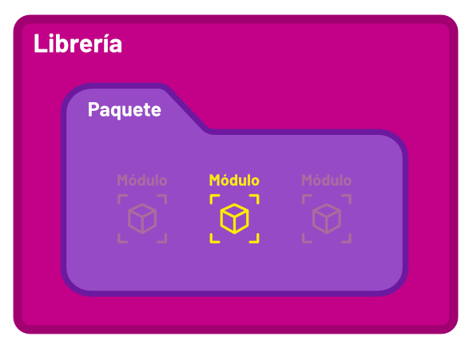

# 💻Clase 11 - Módulos,  paquetes y subpaquetes

---

# Forma secuencial versus forma modular

> Los códigos de este ejemplo los puedes [descargar desde aquí](https://tajamar365.sharepoint.com/:f:/s/356033.2PYTHONF241783AA/Egrt-XIfYBxFslsj0mGfliIBHko1_FtBNHl_Qr28zYRBXQ?e=5TK1lZ).
> 

## Ejercicio propuesto 1 : Modifica el ejemplo resuelto en clase añadiendo resta, multiplicación y división.

# Idea básica Módulos

> Los códigos de esta sección los puedes [descargar desde aquí](https://tajamar365.sharepoint.com/:f:/s/356033.2PYTHONF241783AA/EiK9UGr5HX1AswxDuFwVCwoBsQChcu_Q0q-5OYqxaNDZvg?e=nQGLPp)
> 

Crear un módulo en Python es tan sencillo como crear un script, sólo tenemos que añadir alguna función a un fichero con la extensión .py, por ejemplo **saludos.py**:

```python
def saludar():
    print("Hola, te estoy saludando desde la función saludar() " \
            "del módulo saludos")
```

Luego ya podremos utilizarlo desde otro script,por ejemplo **script.py**, en el mismo directorio haciendo un *import* y el nombre del módulo:

```python
import saludos

saludos.saludar()
```

También podemos importar funciones directamente, de esta forma ahorraríamos memoria. Podemos hacerlo utilizando la sintaxis *from import*:

```python
from saludos import saludar

saludar()
```

Dicho esto, a parte de funciones también podemos reutilizar clases:

```python
class Saludo():
    def __init__(self):
        print("Hola, te estoy saludando desde el __init__ " \
                "de la clase Saludo")
```

Igual que antes, tendremos que llamar primero al módulo para referirnos a la clase:

```python
import saludos

saludos.Saludo()
```

O cargar solo una clase con el from import:

```python
from saludos import Saludo

Saludo()
```

El problema ocurre cuando queremos utilizar nuestro módulo desde un directorio distinto.

## Ejercicio propuesto 2: Modificar el ejemplo anterior, esta vez en vez de saludar utilizar despedir

# Idea básica paquetes

> Los códigos de esta sección los puedes [descargar desde aqui](https://tajamar365.sharepoint.com/:f:/s/356033.2PYTHONF241783AA/EhDgoERJwUBGn-vy8ufZYawBVf6g68eBHLsyH8-f0atrFQ?e=Qoc8Qe).
> 

Utilizar paquetes nos ofrece varias ventajas. En primer lugar nos permite unificar distintos módulos bajo un mismo nombre de paquete, pudiendo crear jerarquías de módulos y submódulos, o también subpaquetes.

Por otra parte nos permiten distribuir y manejar fácilmente nuestro código como si fueran librerías instalables de Python. De esta forma se pueden utilizar como módulos estándar desde el intérprete o scripts sin cargarlos previamente.

Para crear un paquete lo que tenemos que hacer es crear un fichero especial *init* **vacío** en el directorio donde tengamos todos los módulos que queremos agrupar. De esta forma cuando Python recorra este directorio será capaz de interpretar una jerarquía de módulos:

```python
script.py
paquete/
    __init__.py
    saludos.py   
```

Ahora, si utilizamos un script desde el mismo directorio donde se encuentra el paquete podemos acceder a los módulos, pero esta vez refiriéndonos al paquete y al módulo, así que debemos hacerlo con from import:

```python
from paquete.saludos import saludar

saludar()
```

# Idea básica subpaquetes

> Los códigos de esta sección los puedes [descargar desde aqui](https://tajamar365.sharepoint.com/:f:/s/356033.2PYTHONF241783AA/EvngCHZr7AFOpmgkpNrYjF8Bb7iWQvGhkQVxrsszWsJo0A?e=kc5U6f)
> 

Esta jerarquía se puede expandir tanto como queramos creando subpaquetes, pero siempre añadiendo el fichero *init* en cada uno de ellos:

```sql
script.py
paquete/
    __init__.py
    hola/
        __init__.py
        saludos.py
    adios/
        __init__.py
        despedidas.py
```

`paquete/hola/saludos.py`

```sql
def saludar():
    print("Hola, te estoy saludando desde la función saludar() " \
          "del módulo saludos")

class Saludo():
    def __init__(self):
        print("Hola, te estoy saludando desde el __init__"  \
              "de la clase Saludo")
```

`paquete/adios/despedidas.py`

```sql
def despedir():
    print("Adiós, me estoy despidiendo desde la función despedir() " \
            "del módulo despedidas")

class Despedida():
    def __init__(self):
        print("Adiós, me estoy despidiendo desde el __init__ " \
                "de la clase Despedida")
```

Ahora de una forma bien sencilla podemos ejecutar las funciones y métodos de los módulos de cada subpaquete:

`script.py`

```sql
from paquete.hola.saludos import saludar
from paquete.adios.despedidas import Despedida

saludar()
Despedida()
```

> Cuando decidimos desarrollar una pieza de software en Python, normalmente usamos distintos ficheros para ello. Algunos de esos ficheros se convertirán en módulos, otros se englobarán en paquetes y existirá uno en concreto que será nuestro punto de entrada (**entry point**), también llamado programa principal (**main**).
Suele ser una buena práctica llamar `main.py` al fichero que contiene nuestro programa principal.
> 
> 
> 
> 

La estructura que suele tener este programa principal es la siguiente:


[The Python Standard Library](https://docs.python.org/3/library/index.html)

[PyPI · The Python Package Index](https://pypi.org/)

## Paquetes

> Cuando el número de módulos que desarrollamos crece, se hace preciso establecer un orden, agruparlos por funcionalidad o según la aplicación y los programas donde se usen. Python emplea la estructura jerárquica de ficheros del sistema operativo para la creación de paquetes.
> 
> 
> 
> 
- De la misma forma en que las unidades, carpetas y subcarpetas nos ayudan a organizar archivos en un sistema operativo, los paquetes nos ayudan a organizar subpaquetes y módulos.

## Ejercicio propuesto 3

Escribe un programa Python que esté organizado de la siguiente manera:

**Paquetes:**

`messages.funny`

`messages.curt` 

**Módulos:**

`modf1.py`, `modf2.py`, `modf3.py` en el paquete `messages.funny`

`modc1.py`,`modc2.py`, `modc3.py` en el paquete `messages.curt`

**Funciones:**

`funf1()` en el módulo `modf1`

`funf2()` en el módulo `modf2`

`funf3()` en el módulo `modf3`

`func1()` en el módulo `modc1`

`func2()` en el módulo `modc2`

`func3()` en el módulo `modc3`

Usa todas las funciones en un programa `client.py`.

## Solución

## Programa

La estructura de directorios será la siguiente:

```
messages
├── __init__.py
├── funny
│   ├── __init__.py
│   ├── modf1.py
│   ├── modf2.py
│   └── modf3.py
└── curt
    ├── __init__.py
    ├── modc1.py
    ├── modc2.py
    └── modc3.py
client.py
```

De estos, `messages`, `funny` y `curt` son directorios, el resto son archivos. Todos los archivos `__init__.py` están vacíos.

### Códigos

```python
# modf1.py
def funf1():
    print('The ability to speak several languages is an asset...')
    print("ability to keep your mouth shut in any language is priceless")
```

```python
# modf2.py
def funf2():
    print('If you cut off your left arm...')
    print('then your right arm would be left')
```

```python
# modf3.py
def funf3():
    print('Alcohol is a solution!')
```

```python
# modc1.py
def func1():
    print('Light travels faster than sound...')
    print('People look intelligent, till they open their mouth')
```

```python
# modc2.py
def func2():
    print('There is no physical evidence to say that today is Tuesday...')
    print('We have to trust someone who kept the count since first day')
```

```python
# modc3.py
def func3():
    print('We spend five days a week pretending to be someone else...')
    print('in order to spend two days being who we are')
```

```python
# client.py
import messages.funny.modf1
import messages.funny.modf2
import messages.funny.modf3

import messages.curt.modc1
import messages.curt.modc2
import messages.curt.modc3

messages.funny.modf1.funf1()
messages.funny.modf2.funf2()
messages.funny.modf3.funf3()

messages.curt.modc1.func1()
messages.curt.modc2.func2()
messages.curt.modc3.func3()
```

<aside>


### Importante

La estructura de directorios es muy importante. Para que un directorio califique como un paquete, debe contener un archivo `__init__.py`.

</aside>

## Ejercicio propuesto 4

### Reescribe las sentencias `import` en el ejercicio 1, de tal manera que usar las funciones en diferentes módulos sea conveniente.

### Solución:

```python
from messages.funny.modf1 import funf1
from messages.funny.modf2 import funf2
from messages.funny.modf3 import funf3

from messages.curt.modc1 import func1
from messages.curt.modc2 import func2
from messages.curt.modc3 import func3

funf1()
funf2()
funf3()

func1()
func2()
func3()
```

### Consejos

- Beneficio - Las llamadas a funciones no necesitan la sintaxis con puntos.
- Limitación - Solo se importa la función especificada.

## Ejercicio propuesto 5
¿Podemos reescribir las siguientes importaciones usando la notación `*`?

```python
from messages.curt.modc1 import func1
from messages.curt.modc2 import func2
from messages.curt.modc3 import func3
from messages.funny.modf1 import funf1
from messages.funny.modf2 import funf2
from messages.funny.modf3 import funf3
```

## Solución

Podemos usar las siguientes sentencias de importación:

```python
# client.py
from messages.curt.modc1 import *
from messages.curt.modc2 import *
from messages.curt.modc3 import *

from messages.funny.modf1 import *
from messages.funny.modf2 import *
from messages.funny.modf3 import *

funf1()
funf2()
funf3()

func1()
func2()
func3()
```

### Consejos

- Limitación - Dado que solo hay una función en cada módulo, usar  `*`no es tan útil.
- Además,  `*`no es tan popular ya que no indica qué función/clase estamos importando.

## Ejercicio propuesto 6: De programación secuencial a modular:

> Supongamos que se nos pide crear una calculadora que haga las operaciones matemáticas básicas, estadísticas descriptivas básicas y algunas operaciones especiales como calcular el logaritmo y la exponencial.
> 

## Versión Secuencial:

```python
import math
import statistics

# ========================
# Datos iniciales
# ========================
a = 10
b = 5
lista = [1, 2, 3, 4, 4, 5]

# ========================
# Operaciones Básicas
# ========================
print("=== Operaciones Básicas ===")
suma = a + b
resta = a - b
multiplicacion = a * b
division = a / b if b != 0 else "Error: división por cero"

print(f"Suma: {suma}")
print(f"Resta: {resta}")
print(f"Multiplicación: {multiplicacion}")
print(f"División: {division}")

# ========================
# Estadísticas
# ========================
print("\n=== Estadísticas Básicas ===")
media = statistics.mean(lista)
mediana = statistics.median(lista)
moda = statistics.mode(lista)

print(f"Media: {media}")
print(f"Mediana: {mediana}")
print(f"Moda: {moda}")

# ========================
# Operaciones Especiales
# ========================
print("\n=== Operaciones Especiales ===")
potencia = a ** b
raiz = math.sqrt(a) if a >= 0 else "Error: raíz de número negativo"
logaritmo = math.log(a) if a > 0 else "Error: logaritmo indefinido"
exponencial = math.exp(b)

print(f"Potencia ({a}^{b}): {potencia}")
print(f"Raíz cuadrada de {a}: {raiz}")
print(f"Logaritmo de {a} base e: {logaritmo}")
print(f"Exponencial de {b}: {exponencial}")

```

## Versión Modular:

### 📁 Estructura del Proyecto

```
.
├── app/
│   ├── __init__.py
│   ├── main.py
│   ├── operaciones_basicas.py
│   └── estadisticas.py
├── paquete/
│   ├── __init__.py
│   ├── suma.py
│   ├── resta.py
│   └── subpaquete/
│       ├── __init__.py
│       ├── multiplicacion.py
│       └── division.py
├── operaciones_especiales/
│   ├── __init__.py
│   ├── potencias_raices.py
│   └── log_exp.py

```

A continuación cada fichero:

### 📄 `paquete/suma.py`

```python
def suma(a, b):
    return a + b
```

### 📄 `paquete/resta.py`

```python
def resta(a, b):
    return a - b
```

### 📄 `paquete/subpaquete/multiplicacion.py`

```python
def multiplicacion(a, b):
    return a * b
```

### 📄 `paquete/subpaquete/division.py`

```python
def division(a, b):
    if b == 0:
        raise ValueError("No se puede dividir entre cero.")
    return a / b
```

### 📄 `operaciones_especiales/potencias_raices.py`

```python
import math

def potencia(base, exponente):
    return base ** exponente

def raiz_cuadrada(numero):
    if numero < 0:
        raise ValueError("No se puede calcular la raíz cuadrada de un número negativo.")
    return math.sqrt(numero)
```

### 📄 `operaciones_especiales/log_exp.py`

```python
import math

def logaritmo(x, base=math.e):
    if x <= 0:
        raise ValueError("El logaritmo sólo está definido para números positivos.")
    return math.log(x, base)

def exponencial(x):
    return math.exp(x)
```

### 📄 `app/operaciones_basicas.py`

```python
from paquete.suma import suma
from paquete.resta import resta
from paquete.subpaquete.multiplicacion import multiplicacion
from paquete.subpaquete.division import division

def operar_todo(a, b):
    return {
        "suma": suma(a, b),
        "resta": resta(a, b),
        "multiplicacion": multiplicacion(a, b),
        "division": division(a, b)
    }

```

### 📄 `app/estadisticas.py`

```python
import statistics

def calcular_media(lista):
    return statistics.mean(lista)

def calcular_mediana(lista):
    return statistics.median(lista)

def calcular_moda(lista):
    return statistics.mode(lista)

```

### 📄 `app/main.py`

```python
from app.operaciones_basicas import operar_todo
from app.estadisticas import calcular_media, calcular_mediana, calcular_moda
from operaciones_especiales.potencias_raices import potencia, raiz_cuadrada
from operaciones_especiales.log_exp import logaritmo, exponencial

def main():
    a = 10
    b = 5
    lista = [1, 2, 3, 4, 4, 5]

    print("=== Operaciones Básicas ===")
    resultados = operar_todo(a, b)
    for operacion, resultado in resultados.items():
        print(f"{operacion}: {resultado}")

    print("\n=== Estadísticas Básicas ===")
    print(f"Media: {calcular_media(lista)}")
    print(f"Mediana: {calcular_mediana(lista)}")
    print(f"Moda: {calcular_moda(lista)}")

    print("\n=== Operaciones Especiales ===")
    print(f"Potencia ({a}^{b}): {potencia(a, b)}")
    print(f"Raíz cuadrada de {a}: {raiz_cuadrada(a)}")
    print(f"Logaritmo de {a} base e: {logaritmo(a)}")
    print(f"Exponencial de {b}: {exponencial(b)}")

if __name__ == "__main__":
    main()

```

### 📄 `__init__.py`(vacio).

Los archivos `__init__.py` son necesarios para que Python trate los directorios como **paquetes importables**. Aunque pueden estar vacíos, su presencia es crucial para que el intérprete reconozca correctamente las rutas como parte del módulo. Puedes dejarlos vacíos o incluir documentación mínima si deseas:

```python
# Este archivo convierte el directorio en un paquete Python

```

## Ejercicio propuesto 7 : Pasar a paradigma modular el siguiente código que se encuentra en paradigma secuencial o imperativo

> **Descripción del Problema**
> 
> 
> Se tiene un sistema de procesamiento de calificaciones implementado en paradigma imperativo (también conocido como monolítico) que procesa datos de estudiantes y sus calificaciones de manera secuencial en un solo archivo. Tu tarea es **convertir este sistema monolítico a una arquitectura modular. A continuación se presenta el código en la versión monolítica:**
> 

### Secuencial/imperativo

```python
# imperativo_completo.py - Paradigma Imperativo
# Programa completo que procesa calificaciones usando programación imperativa

# Variables globales para almacenar todos los datos
estudiantes = ["Ana", "Luis", "María", "Carlos", "Sofia"]
calificaciones = [85, 92, 78, 96, 88]

# Variables para cálculos estadísticos
suma_total = 0
promedio = 0
mediana = 0
rango = 0

# Variables para conteo de estudiantes
aprobados = 0
reprobados = 0
total_estudiantes = 0

# Variables para mejores y peores estudiantes
mejor_estudiante = ""
mejor_nota = 0
peor_estudiante = ""
peor_nota = 0
nota_maxima = 0
nota_minima = 0

# Variables para formateo y presentación
separador_largo = "=" * 60
separador_corto = "-" * 40
porcentaje_aprobados = 0

print(separador_largo)
print("   SISTEMA IMPERATIVO DE CALIFICACIONES")
print(separador_largo)

# Validación manual de datos
print("Validando datos de entrada...")
datos_validos = True
mensaje_error = ""

if len(estudiantes) == 0:
    datos_validos = False
    mensaje_error = "La lista de estudiantes está vacía"
elif len(calificaciones) == 0:
    datos_validos = False
    mensaje_error = "La lista de calificaciones está vacía"
elif len(estudiantes) != len(calificaciones):
    datos_validos = False
    mensaje_error = "Las listas deben tener la misma longitud"
else:
    # Validar cada calificación
    for i in range(len(calificaciones)):
        if calificaciones[i] < 0 or calificaciones[i] > 100:
            datos_validos = False
            mensaje_error = f"La calificación {calificaciones[i]} está fuera del rango válido (0-100)"
            break

if datos_validos:
    print("Resultado: Datos válidos")
else:
    print(f"ERROR: {mensaje_error}")
    print("No se pueden procesar datos inválidos")
    exit()

print(separador_corto)

# Mostrar datos iniciales
print("DATOS INICIALES:")
for i in range(len(estudiantes)):
    print(f"  {estudiantes[i]}: {calificaciones[i]}")

# === CÁLCULOS ESTADÍSTICOS ===
print(f"\n{separador_largo}")
print("   ANÁLISIS ESTADÍSTICO")
print(separador_largo)

# Calcular suma total paso a paso
print("Calculando suma total...")
suma_total = 0
for i in range(len(calificaciones)):
    suma_total = suma_total + calificaciones[i]
    print(f"  Sumando {calificaciones[i]}: total parcial = {suma_total}")

print(f"Suma total de calificaciones: {suma_total}")

# Calcular promedio
total_estudiantes = len(calificaciones)
promedio = suma_total / total_estudiantes
print(f"Promedio general: {promedio:.2f}")

# Calcular mediana (ordenamiento manual)
print("Calculando mediana...")
calificaciones_ordenadas = []
for nota in calificaciones:
    calificaciones_ordenadas.append(nota)

# Ordenamiento burbuja manual
for i in range(len(calificaciones_ordenadas)):
    for j in range(0, len(calificaciones_ordenadas) - 1 - i):
        if calificaciones_ordenadas[j] > calificaciones_ordenadas[j + 1]:
            # Intercambiar
            temp = calificaciones_ordenadas[j]
            calificaciones_ordenadas[j] = calificaciones_ordenadas[j + 1]
            calificaciones_ordenadas[j + 1] = temp

print(f"Calificaciones ordenadas: {calificaciones_ordenadas}")

# Calcular mediana según si es par o impar
n = len(calificaciones_ordenadas)
if n % 2 == 0:
    mediana = (calificaciones_ordenadas[n//2 - 1] + calificaciones_ordenadas[n//2]) / 2
else:
    mediana = calificaciones_ordenadas[n//2]

print(f"Mediana: {mediana}")

# Calcular rango (diferencia entre máximo y mínimo)
nota_maxima = calificaciones[0]
nota_minima = calificaciones[0]

for i in range(1, len(calificaciones)):
    if calificaciones[i] > nota_maxima:
        nota_maxima = calificaciones[i]
    if calificaciones[i] < nota_minima:
        nota_minima = calificaciones[i]

rango = nota_maxima - nota_minima
print(f"Rango (max - min): {rango}")

# === ANÁLISIS DE ESTUDIANTES ===
print(f"\n{separador_largo}")
print("   ANÁLISIS DE ESTUDIANTES")
print(separador_largo)

# Contar aprobados y reprobados paso a paso
print("Contando aprobados y reprobados...")
aprobados = 0
reprobados = 0

for i in range(len(calificaciones)):
    if calificaciones[i] >= 80:
        aprobados = aprobados + 1
        print(f"  {estudiantes[i]} APROBÓ con {calificaciones[i]}")
    else:
        reprobados = reprobados + 1
        print(f"  {estudiantes[i]} REPROBÓ con {calificaciones[i]}")

print(f"Estudiantes aprobados: {aprobados}")
print(f"Estudiantes reprobados: {reprobados}")

# Encontrar mejor y peor estudiante paso a paso
print("\nBuscando mejor y peor estudiante...")
mejor_nota = calificaciones[0]
peor_nota = calificaciones[0]
mejor_estudiante = estudiantes[0]
peor_estudiante = estudiantes[0]

for i in range(1, len(calificaciones)):
    if calificaciones[i] > mejor_nota:
        mejor_nota = calificaciones[i]
        mejor_estudiante = estudiantes[i]
        print(f"  Nuevo mejor: {mejor_estudiante} ({mejor_nota})")
    
    if calificaciones[i] < peor_nota:
        peor_nota = calificaciones[i]
        peor_estudiante = estudiantes[i]
        print(f"  Nuevo peor: {peor_estudiante} ({peor_nota})")

print(f"Mejor rendimiento: {mejor_estudiante} ({mejor_nota})")
print(f"Menor rendimiento: {peor_estudiante} ({peor_nota})")

# Calcular porcentaje de aprobados
porcentaje_aprobados = (aprobados / total_estudiantes) * 100

# Crear resumen del estado
resumen = ""
if aprobados > reprobados:
    resumen = f"Buen rendimiento general: {porcentaje_aprobados:.1f}% de aprobación"
elif reprobados > aprobados:
    resumen = f"Rendimiento preocupante: solo {porcentaje_aprobados:.1f}% de aprobación"
else:
    resumen = f"Rendimiento equilibrado: {porcentaje_aprobados:.1f}% de aprobación"

print(f"\nResumen: {resumen}")

# === REPORTE COMPLETO ===
print(f"\n{separador_largo}")
print("   REPORTE COMPLETO")
print(separador_largo)

print("=== REPORTE COMPLETO ===")
print(f"Total estudiantes: {total_estudiantes}")
print(f"Suma total: {suma_total}")
print(f"Promedio general: {promedio:.2f}")
print(f"Aprobados: {aprobados} ({porcentaje_aprobados:.1f}%)")
print(f"Reprobados: {reprobados}")
print("")
print("=== EXTREMOS ===")
print(f"Mejor estudiante: {mejor_estudiante} ({mejor_nota})")
print(f"Peor estudiante: {peor_estudiante} ({peor_nota})")
print(f"Nota más alta: {nota_maxima}")
print(f"Nota más baja: {nota_minima}")

# === REPORTE INDIVIDUAL POR ESTUDIANTE ===
print(f"\n{separador_largo}")
print("   REPORTE INDIVIDUAL")
print(separador_largo)

print("Análisis individual por estudiante:")
for i in range(len(estudiantes)):
    diferencia_promedio = calificaciones[i] - promedio
    estado = "APROBADO" if calificaciones[i] >= 80 else "REPROBADO"
    
    if diferencia_promedio > 0:
        comparacion = f"(+{diferencia_promedio:.1f} sobre el promedio)"
    elif diferencia_promedio < 0:
        comparacion = f"({diferencia_promedio:.1f} bajo el promedio)"
    else:
        comparacion = "(igual al promedio)"
    
    print(f"  {estudiantes[i]}: {calificaciones[i]} - {estado} {comparacion}")

# === INFORMACIÓN ADICIONAL ===
print(f"\n{separador_largo}")
print("   ANÁLISIS ADICIONAL")
print(separador_largo)

# Buscar estudiantes en rangos específicos
print("Estudiantes por rangos de calificación:")

# Rango excelente (90-100)
excelentes = 0
print("Excelente (90-100):")
for i in range(len(estudiantes)):
    if 90 <= calificaciones[i] <= 100:
        excelentes = excelentes + 1
        print(f"  {estudiantes[i]}: {calificaciones[i]}")
if excelentes == 0:
    print("  Ninguno")

# Rango bueno (80-89)
buenos = 0
print("Bueno (80-89):")
for i in range(len(estudiantes)):
    if 80 <= calificaciones[i] <= 89:
        buenos = buenos + 1
        print(f"  {estudiantes[i]}: {calificaciones[i]}")
if buenos == 0:
    print("  Ninguno")

# Rango regular (70-79)
regulares = 0
print("Regular (70-79):")
for i in range(len(estudiantes)):
    if 70 <= calificaciones[i] <= 79:
        regulares = regulares + 1
        print(f"  {estudiantes[i]}: {calificaciones[i]}")
if regulares == 0:
    print("  Ninguno")

# Rango deficiente (0-69)
deficientes = 0
print("Deficiente (0-69):")
for i in range(len(estudiantes)):
    if 0 <= calificaciones[i] <= 69:
        deficientes = deficientes + 1
        print(f"  {estudiantes[i]}: {calificaciones[i]}")
if deficientes == 0:
    print("  Ninguno")

# === INFORMACIÓN DEL PARADIGMA ===
print(f"\n{separador_largo}")
print("   INFORMACIÓN DEL PARADIGMA")
print(separador_largo)

print("Paradigma imperativo utilizado:")
print("  ✓ Código secuencial paso a paso")
print("  ✓ Variables globales para almacenar estado")
print("  ✓ Bucles explícitos para procesamiento")
print("  ✓ Lógica procedural sin funciones")
print("  ✓ Modificación directa de variables")
print("  ✓ Todo el código en un solo archivo")

print(f"\n{separador_largo}")
print("   Procesamiento completado exitosamente")
print(separador_largo)

# Mostrar estadísticas finales del procesamiento
print("\nEstadísticas del procesamiento:")
print(f"  Variables utilizadas: aproximadamente 20")
print(f"  Líneas de código ejecutadas: todas secuencialmente")
print(f"  Bucles realizados: múltiples for loops")
print(f"  Operaciones matemáticas: suma, división, comparaciones")
print(f"  Paradigma: Imperativo puro")
```